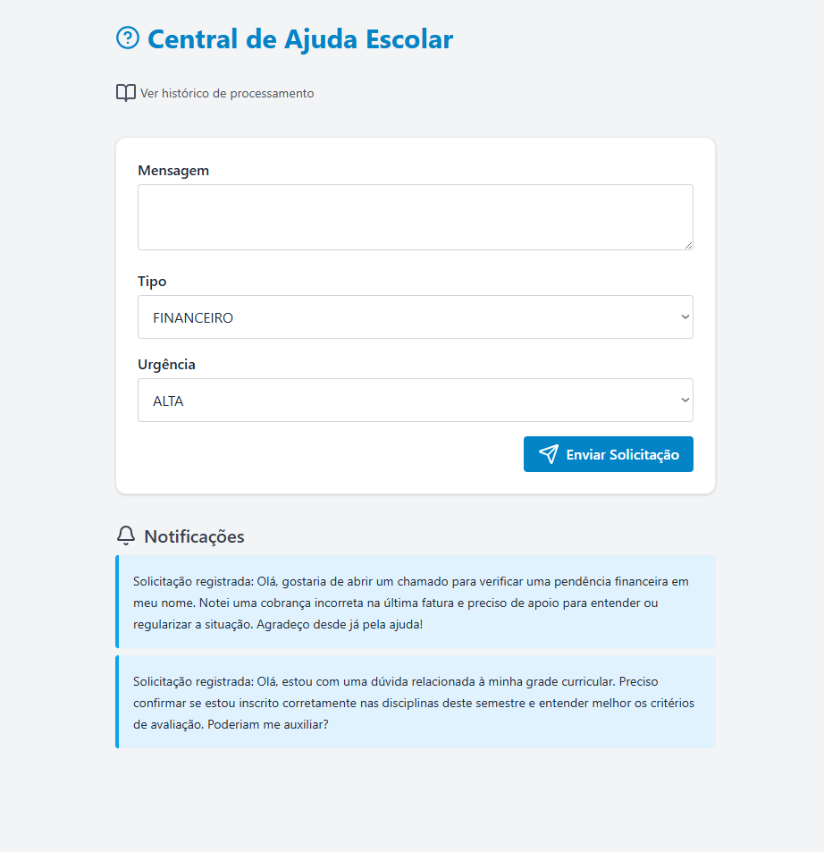
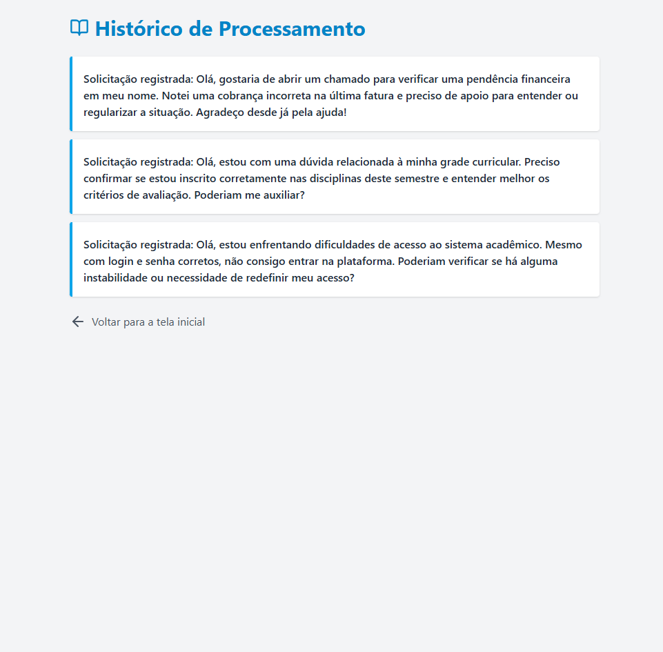

# 🧪 HelpDesk Escolar — Central de Chamados com Design Patterns

Este projeto simula uma **Central de Ajuda Escolar**, permitindo que alunos registrem solicitações para diferentes setores da instituição, como **Financeiro**, **Pedagógico**, **Infraestrutura** e **Tecnologia**. Cada solicitação passa por uma série de validações e gera notificações automáticas para os envolvidos, promovendo uma gestão eficiente e organizada dos chamados.

---

## 📚 Contexto

Ambientes educacionais frequentemente enfrentam demandas administrativas e técnicas que precisam ser direcionadas aos setores corretos com agilidade e rastreabilidade. Este sistema propõe uma solução para centralizar essas comunicações, utilizando conceitos sólidos de **Orientação a Objetos**, **arquitetura limpa** e **padrões de projeto (Design Patterns)**.

---

## 📸 Interface do Sistema

Abaixo, dois prints do sistema em funcionamento:

### 🖼️ Tela de abertura de chamados

### 🖼️ Histórico de solicitações

---

## 🛠️ Funcionalidades

- 📥 Registro de chamados por setor (Financeiro, Pedagógico, Infraestrutura, Tecnologia)
- ⏰ Validações automáticas de regras antes da submissão
- 🔔 Geração de notificações internas e para o solicitante
- 🧩 Uso de Design Patterns para organizar regras de negócio e desacoplar componentes
- 💾 Banco de dados em memória para testes (H2)
- 🌐 Interface HTML com Thymeleaf para interação do usuário

---

## 🧠 Regras de Negócio Implementadas

Cada solicitação passa por uma cadeia de verificações para garantir sua validade de acordo com o contexto institucional:

- ✅ A solicitação deve ser feita **em dias úteis** (segunda a sexta)
- ✅ Solicitações **urgentes** só são aceitas entre **08h e 22h**
- ✅ Chamados do tipo **Financeiro** devem ser abertos apenas em **horário comercial**
- ✅ A descrição da solicitação deve conter **no mínimo 10 caracteres**

Essas regras são executadas dinamicamente utilizando o padrão **Chain of Responsibility**, onde cada regra é encapsulada em um handler e encadeada em tempo de execução.

---

## 🔔 Sistema de Notificações

Toda nova solicitação gera eventos que são monitorados por diferentes **observadores**. Cada observador é responsável por uma ação, como:

- 📬 Envio de feedback ao aluno (confirmação da solicitação)
- 📄 Registro da ação no log interno da aplicação

Esse comportamento é possível graças à aplicação do padrão **Observer**, que permite que múltiplas ações sejam desencadeadas a partir de um único evento, mantendo os módulos desacoplados.

---
